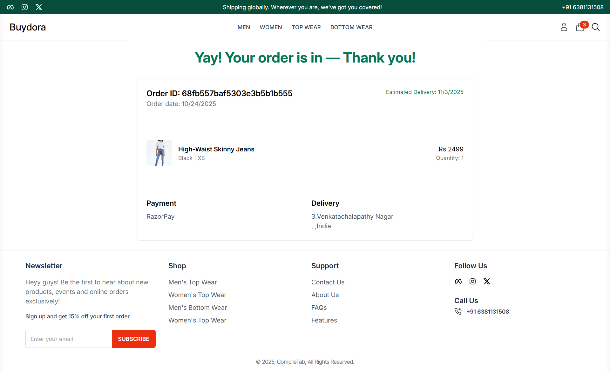

# 🛍️ BuyDora — Modern eCommerce Fashion Platform

BuyDora is a full-stack e-commerce web application designed to provide a seamless shopping experience. Built with the **MERN Stack** (MongoDB, Express, React, Node.js), it lets customers browse products, manage their cart, and complete purchases securely. The app features a modern React frontend with a Node.js/Express backend and MongoDB database.

<p align="center">
  <strong>Discover • Browse • Shop • Enjoy</strong>
</p>

---

## 🚀 Key Features

###  **Shopping Experience**
-  **Dynamic Product Catalog**: Browse products with detailed information and images
-  **Product Collections**: Organized collections with categories and filters
- **Shopping Cart**: Add/remove items, review totals, and manage quantities
-  **Secure Checkout**: Complete purchase flow with order confirmation
-  **Product Search**: Advanced filtering and search capabilities

### 🧑‍💼 **User Accounts & Authentication**
-  Secure signup/login with **JSON Web Tokens (JWT)**
-  Encrypted passwords using bcrypt
-  User profile management
-  Order history tracking

###  **Payment Integration**
-  **Razorpay** payment support
-  Secure transaction processing
-  Order confirmation with details

###  **Admin Dashboard**
-  Protected admin routes for site management
-  **Product CRUD**: Add, edit, delete products
-  **User Management**: View and manage users
-  **Order Management**: View, track, and process orders

###  **AI Chatbot (Hugging Face Integration)**
-  Built-in AI-powered chat widget using **Hugging Face API**
-  Customer support and product inquiries
-  Intelligent responses for shopping assistance
-  Real-time conversation interface

###  **Additional Features**
-  **Newsletter Subscription**: Email signup for updates and promotions
-  **Image Uploads**: Product image upload and storage
-  **Responsive Design**: Mobile-friendly UI with Tailwind CSS
-  Modern, clean interface built with Vite
-  Redux state management

---


### **Key Technologies**
- **Authentication**: JWT (JSON Web Tokens), bcrypt
- **Payment Gateways**: PayPal, Razorpay
- **AI Integration**: Hugging Face API
- **State Management**: Redux Toolkit
- **File Upload**: Multer
- **Styling**: Tailwind CSS

##  Installation & Setup

### **Prerequisites**
- Node.js v14+ and npm
- MongoDB (local or MongoDB Atlas)
- PayPal Developer Account (for payment testing)
- Hugging Face API Key

### **Step 1: Clone the Repository**
```bash
git clone https://github.com/Irfan240305/BuyDora---eCommerce-website.git
cd BuyDora
```

### **Step 2: Backend Setup**
```bash
cd backend
npm install
```

Create a `.env` file in the `backend` folder:
```env
MONGO_URI=mongodb://your-mongodb-connection-string
JWT_SECRET=your-secret-key-here
HUGGINGFACE_API_KEY=your-huggingface-api-key
PORT=9000
PAYPAL_CLIENT_ID=your-paypal-client-id
RAZORPAY_KEY_ID=your-razorpay-key
```

Start the backend server:
```bash
node server.js
# or
npm run dev
```

### **Step 3: Frontend Setup**
```bash
cd ../frontend
npm install
```

Create a `.env` file in the `frontend` folder:
```env
VITE_BACKEND_URL=http://localhost:9000
VITE_PAYPAL_CLIENT_ID=your-paypal-client-id
```

Start the frontend development server:
```bash
npm run dev
```

### **Step 4: Access the Application**
Open your browser and navigate to:
```
http://localhost:5173
```

---

## 🎯 Key Implementations

✅ **Full CRUD operations** for products, users, and orders  
✅ **JWT Authentication** with secure password encryption  
✅ **Shopping cart** with local storage persistence  
✅ **Payment gateway integration** (PayPal & Razorpay)  
✅ **AI-powered chatbot** using Hugging Face API  
✅ **Image upload and storage** for product images  
✅ **Product search and filtering** with category support  
✅ **Admin panel** with role-based access control  
✅ **Responsive design** for desktop and mobile  
✅ **Newsletter subscription** system  
✅ **Order processing and confirmation** flow  
✅ **Environment variables** for security  
✅ **Error handling and validation**

---

##  Contributing

Contributions are welcome! Here's how you can help:

1. Fork the repository
2. Create a feature branch (`git checkout -b feature/amazing-feature`)
3. Commit your changes (`git commit -m 'Add amazing feature'`)
4. Push to the branch (`git push origin feature/amazing-feature`)
5. Open a Pull Request

For major changes, please open an issue first to discuss your ideas.

---

##  Contact & Support

- **GitHub:** [@Irfan240305](https://github.com/Irfan240305)
- **Email:** irfanubaidhu@gmail.com
- **LinkedIn:** [Your Profile](https://linkedin.com/in/your-profile)
- **Issues:** Report bugs via [GitHub Issues](https://github.com/Irfan240305/BuyDora---eCommerce-website/issues)

---

##  License

This project is released under the **ISC License**. Feel free to use it for personal, educational, or commercial purposes.

---

##  Acknowledgments

- React & Vite communities
- MongoDB and Mongoose documentation
- Express.js best practices
- Hugging Face API documentation
- PayPal & Razorpay developer resources
- Tailwind CSS framework
- All contributors and supporters

---
## 📸 Screenshots

| Home Page | Collections | Order Confirmation |
|-----------|------------|-------------------|
|  |  |  |

**Home Page:** Browse featured products, trending items, and categories with elegant navigation.

**Collections:** Explore organized product collections with filters, sorting, and responsive grid layout styled with Tailwind CSS.

**Order Confirmation:** Complete checkout flow with order summary, confirmation message, and order details.


## 🔮 Future Enhancements

-  Multi-language support
-  Product reviews and ratings
-  Advanced analytics dashboard
-  Discount codes and promotions
-  Email order notifications
-  Push notifications
-  Dark mode support

---

<p align="center">
  Made with ❤️ by Irfan
  <br>
  <a href="https://github.com/Irfan240305/BuyDora---eCommerce-website">⭐ Star this repo if you like it!</a>
</p>
